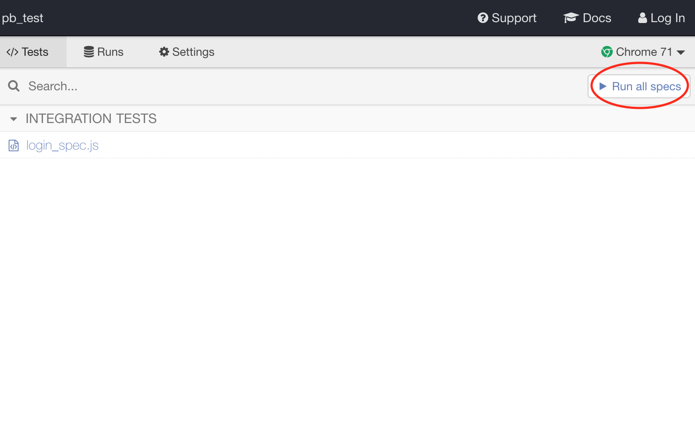

## Perkbox tech test 

A specific feature has just been implemented by the development team on the following URL :  https://app.perkbox.com

We need to : 

1)  List all possible test scenarios for this feature

2) Choose two of the scenarios and carry out manual testing on these. Write up a test 

3) Choose two of the scenarios and write automated tests for these in the 


## My answers : 

- Adding a markdown file to this repository in order to answer the first question. Please see the all_scenarios.md file in this repository.

- Adding a markdown file to this repository in order to answer the second question. Please see the manual_testing.md file in this repository.

- Using Cypress UI testing framework in order to run two scenarios with automated tests. More details in the next section. 


## Running Cypress tests 

In order to use the Cypress testing framework, we need to open Cypress browser environment with the following command : 

```
npm test
```

The special Cypress browser will open up with the tests that are written under the integration/login_spec.js file 

On the cypress testing browser, please click on "Run all specs" in order to run all the tests. Screenshot below : 




Then you should see the cypress browser environment reproduce every single step detailed under the integration/login_spec.js file 


